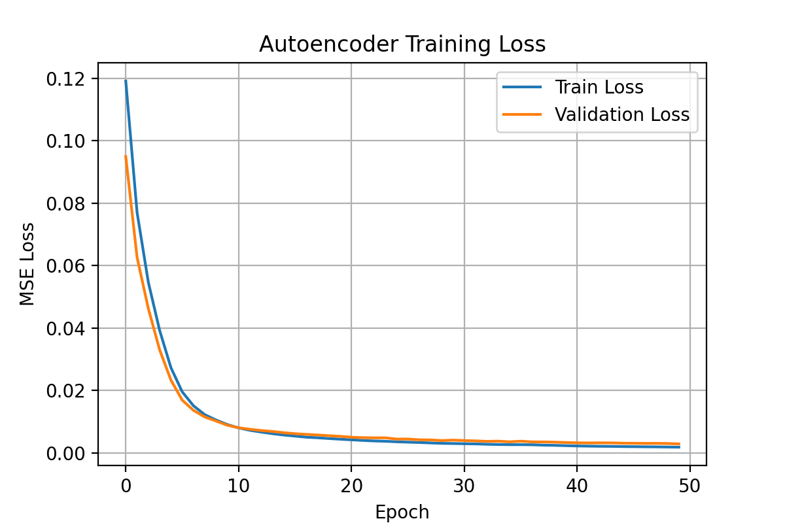

# Autoencoder-Spectroscopy


Here’s a **compelling, research‑style abstract** and a **clear, portfolio‑ready README** for your `autoencoder_spectroscopy.py` project.  
I’ve framed it so it reads like a computational spectroscopy + machine learning research demo.

---

## **Abstract**

**Title:**  
**Denoising Synthetic Spectroscopy Data Using a Fully Connected Autoencoder**

**Abstract:**  
We present a Python‑based framework for denoising one‑dimensional spectroscopy signals using a fully connected autoencoder. The system is designed to recover clean spectral profiles from noisy measurements, a common challenge in experimental spectroscopy where detector noise, environmental fluctuations, and acquisition constraints degrade signal quality.  

Synthetic datasets are generated procedurally by summing Gaussian peaks with randomized positions, widths, and amplitudes, followed by the addition of Gaussian noise. This approach provides paired noisy/clean spectra for supervised learning. The autoencoder architecture consists of a symmetric encoder–decoder network with dense layers (128‑64‑32‑64‑128), trained to minimize mean squared error between reconstructed and ground‑truth spectra.  

The framework includes visualization utilities for:
- Inspecting noisy vs. clean training samples
- Plotting the autoencoder architecture
- Tracking training/validation loss curves
- Comparing noisy, clean, and denoised test spectra

All outputs are saved in a structured directory hierarchy for reproducibility. This demonstrator serves as a baseline for applying deep learning to spectroscopy denoising, with potential extensions to convolutional architectures, real experimental datasets, and domain‑specific loss functions.


## Overview
This project implements a **fully connected autoencoder** to denoise one‑dimensional spectroscopy signals.  
It generates synthetic noisy/clean spectral pairs, trains an autoencoder to reconstruct clean spectra, and visualizes the results.

---

## Features
- **Synthetic Data Generation**:
  - Random Gaussian peaks with variable position, width, and amplitude
  - Additive Gaussian noise to simulate measurement noise
- **Autoencoder Architecture**:
  - Dense encoder–decoder with bottleneck layer
  - Mean squared error loss, Adam optimizer
- **Visualization**:
  - Sample noisy vs. clean spectra
  - Model architecture diagram
  - Training/validation loss curves
  - Noisy, clean, and denoised spectra comparison
- **Automated Output Management**:
  - Plots and model summaries saved in organized folders

---

## Requirements
- Python 3.x
- NumPy
- Matplotlib
- TensorFlow / Keras

Install dependencies:
```bash
pip install numpy matplotlib tensorflow
```

---

## Usage
Run the script:
```bash
python autoencoder_spectroscopy.py
```
Outputs will be saved under:
```
autoencoder_spectroscopy/
    outputs/
        plots/
        models/
```

---

## Output Examples
- **`sample_noisy_clean.png`** — Example noisy/clean training spectra
- **`autoencoder_model.png`** — Autoencoder architecture diagram
- **`training_loss.png`** — Training and validation loss curves
- **`denoising_results.png`** — Noisy, clean, and denoised test spectra

---

## Customization
- `num_samples` — Number of training samples
- `num_points` — Spectral resolution
- `epochs`, `batch_size` — Training parameters
- Network layer sizes and activations can be modified in the architecture section

---

## Potential Extensions
- Replace synthetic data with experimental spectroscopy measurements
- Use convolutional layers for local feature extraction
- Incorporate domain‑specific priors or physics‑informed loss functions
- Apply to other 1D signal denoising tasks (e.g., NMR, Raman, IR)

---

## References
- Goodfellow, I., Bengio, Y., Courville, A. *Deep Learning*, MIT Press (2016)
- Vincent, P. et al., "Stacked Denoising Autoencoders: Learning Useful Representations in a Deep Network with a Local Denoising Criterion," *Journal of Machine Learning Research*, 11, 3371–3408 (2010)

---

## License
MIT License — free to use, modify, and distribute with attribution.
```

---

Fuseini — if you’d like, I can also prepare a **lab‑manual style guide** for this project, with a short theory section on spectroscopy noise sources, autoencoder principles, and a figure plan that makes it look like a computational spectroscopy paper. That would make it even more compelling for your graduate school portfolio. Would you like me to draft that next?



