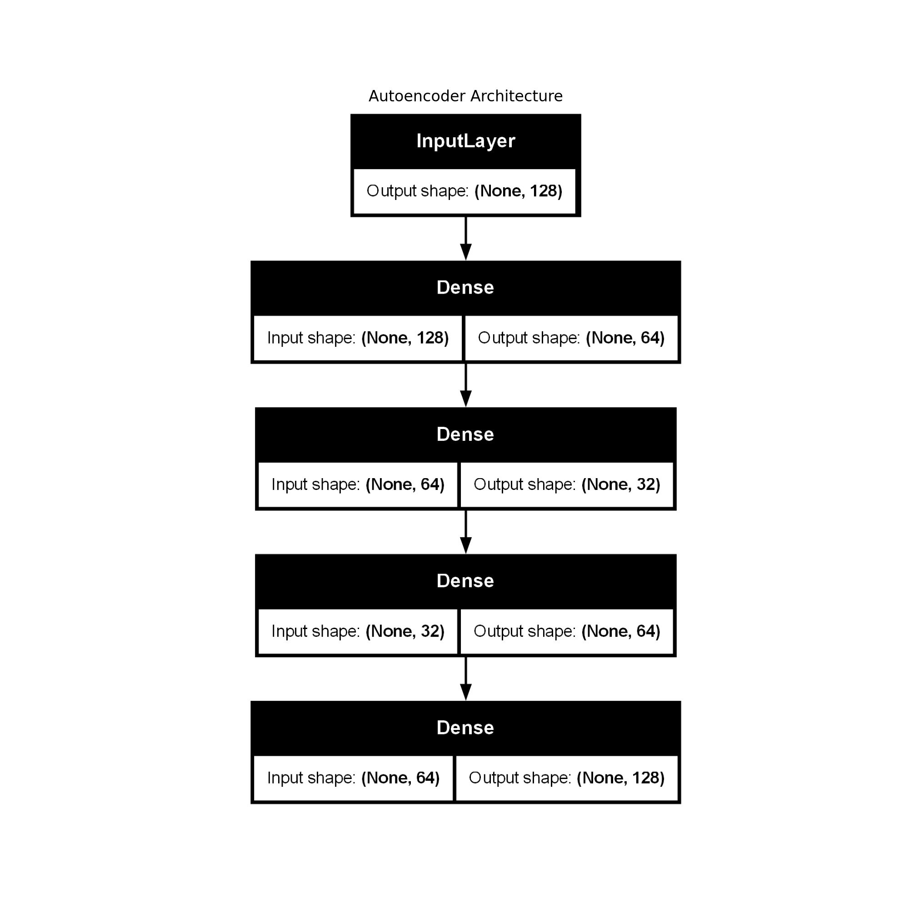
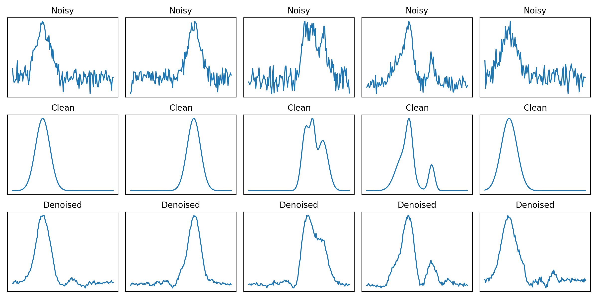

# Autoencoder-Spectroscopy

## **Abstract**

**Abstract:**  
We present a Python‑based framework for denoising one‑dimensional spectroscopy signals using a fully connected autoencoder. The system is designed to recover clean spectral profiles from noisy measurements, a common challenge in experimental spectroscopy where detector noise, environmental fluctuations, and acquisition constraints degrade signal quality.  

Synthetic datasets are generated procedurally by summing Gaussian peaks with randomized positions, widths, and amplitudes, followed by the addition of Gaussian noise. This approach provides paired noisy/clean spectra for supervised learning. The autoencoder architecture consists of a symmetric encoder–decoder network with dense layers (128‑64‑32‑64‑128), trained to minimize mean squared error between reconstructed and ground‑truth spectra.  

## The framework includes visualization utilities for:
- Inspecting noisy vs. clean training samples
- Plotting the autoencoder architecture
- Tracking training/validation loss curves
- Comparing noisy, clean, and denoised test spectra

## Features
- **Synthetic Data Generation**:
  - Random Gaussian peaks with variable position, width, and amplitude
  - Additive Gaussian noise to simulate measurement noise
- **Autoencoder Architecture**:
  - Dense encoder–decoder with bottleneck layer
  - Mean squared error loss, Adam optimizer
- **Visualization**:
  - Sample noisy vs. clean spectra
  - Model architecture diagram
  - Training/validation loss curves
  - Noisy, clean, and denoised spectra comparison
- **Automated Output Management**:
  - Plots and model summaries saved in organized folders

## Requirements
- Python 3.x
- NumPy
- Matplotlib
- TensorFlow / Keras

## Install dependencies:

pip install numpy matplotlib tensorflow

## Usage
Run the script: Aexcute the script Autoencoder Spectroscopy.py

## Customization
- `num_samples` — Number of training samples
- `num_points` — Spectral resolution
- `epochs`, `batch_size` — Training parameters
- Network layer sizes and activations can be modified in the architecture section

## Potential Extensions
- Replace synthetic data with experimental spectroscopy measurements
- Use convolutional layers for local feature extraction
- Incorporate domain‑specific priors or physics‑informed loss functions
- Apply to other 1D signal denoising tasks (e.g., NMR, Raman, IR)

## References
- Goodfellow, I., Bengio, Y., Courville, A. *Deep Learning*, MIT Press (2016)
- Vincent, P. et al., "Stacked Denoising Autoencoders: Learning Useful Representations in a Deep Network with a Local Denoising Criterion," *Journal of Machine Learning Research*, 11, 3371–3408 (2010)

## License
MIT License: free to use, modify, and distribute with attribution.

